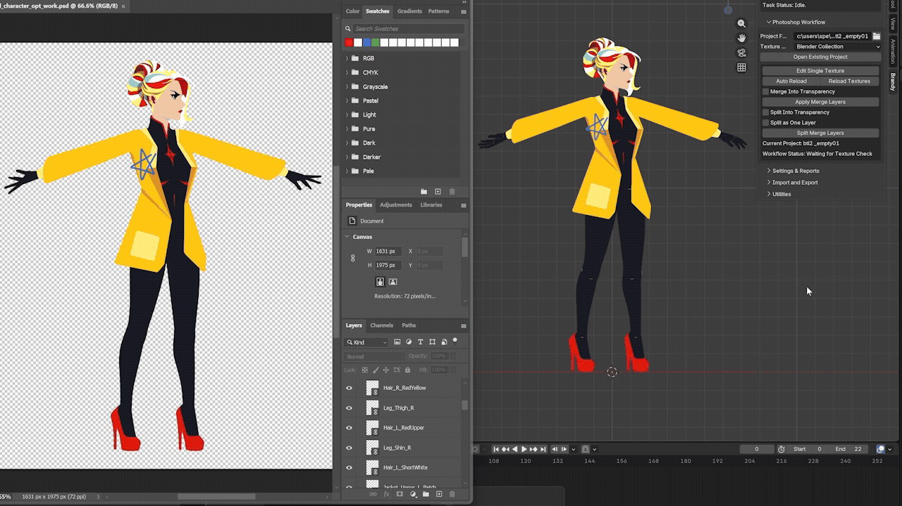
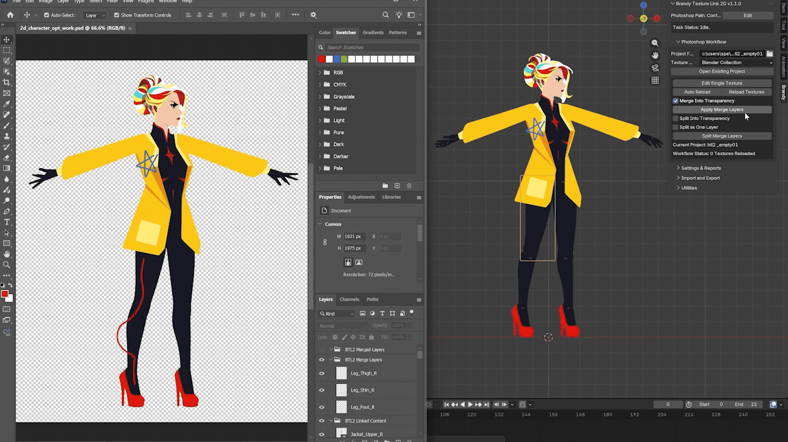

# Brandy Texture Link 2D

[User Guide](docs/UserGuide.md) · [Support](docs/SUPPORT.md) · [Maintenance](docs/Maintenance.md) · [Change Log](docs/ChangeLog.md) · [中文主页](README_zh-CN.md)

**Brandy Texture Link 2D is a Blender add-on for 2D texture workflows. It lets you batch-edit textures in Photoshop and automatically reload saved changes in Blender.**

You can create a **project folder** from either a **Blender Collection** or a **PSD document**. The project links Blender and Photoshop. It can rebuild a Blender texture layout in Photoshop or bring a PSD layer layout into Blender, then keep the textures connected for later editing and reloading.

For 2D game and animation workflows, this reduces the manual setup and relinking normally required when editing the same asset across Blender and Photoshop.

The project folder acts as the bridge between the two applications. It includes safeguards for `project backup and recovery`, `safe undo`, `switching between projects`, and `moving project copies`. The add-on has completed a 7 × 5 version test matrix, including Blender 5.2.0 LTS.

For a quick start, continue below. For `detailed workflows and important usage notes`, watch the tutorials or see the [User Guide](docs/UserGuide.md). For `test details`, see [Maintenance](docs/Maintenance.md).

The interface is available in Chinese and English. Change the default language with **Interface Language** under **Settings & Reports**, then reload the add-on or restart Blender.

If you have questions or want to report an issue, see [Support](docs/SUPPORT.md) or contact `brandyspe2026@gmail.com`. I will reply as soon as I can after receiving your email.

## Quick Start

First complete the basic installation and setup:

1. In Blender, open **Edit** > **Preferences** > **Get Extensions** > the menu in the upper-right corner > **Install from Disk**, then select the complete Brandy Texture Link 2D.zip package. Do not extract the ZIP first.

2. Make sure Brandy Texture Link 2D is enabled under **Preferences** > **Add-ons**.

3. Return to the 3D View and press `N` to open the sidebar. Open the **Brandy** tab, then set **Photoshop Path** to `Photoshop.exe` in your Photoshop installation folder.

### Create a Project from a Blender Collection

1. Under **Project Folder**, choose an empty local folder and keep **Texture Source** set to **Blender Collection**.

2. Put all flat rectangular Mesh objects you want to edit (referred to below as `2D sprites`) into one Blender collection. Select that collection under **Project Collection**, then click **Create Project**.

3. The add-on copies the source textures used by those `2D sprites` into the project folder and creates a new PSD document that rebuilds the texture layout from Blender in Photoshop. Your original source textures are not modified.

### Create a Project from a PSD Document

1. Under **Project Folder**, choose an empty local folder, then change **Texture Source** to **Photoshop document**.

2. Under **PSD Document**, choose the PSD you want to import. Set options such as **Transparent Pixel Padding**, **Use Alpha**, and **Sprite Z Spacing**, then click **Create Project**.

3. For each successfully imported layer or asset, the add-on creates a `2D sprite` in Blender and uses the layer content as its texture. The front-to-back order of the sprites is built from the layer order in the PSD document.

## Editing and Reloading

Whichever way you create the link, Photoshop is launched after the **project folder** is created.

The add-on also shows the editing controls, including **Edit Single Texture** and **Apply Merge Layers**, for the two main workflows: `single-texture editing` and `multi-texture editing`.

The working PSD contains three layer groups: **BTL2 Linked Content**, **BTL2 Merge Layers**, and **BTL2 Merged Layers**. Do not delete these groups.

**BTL2 Linked Content** contains the Smart Objects that match the names of your `2D sprites`. Their texture links, layout, and Alpha information are recorded when the project is created.

**BTL2 Merge Layers** and **BTL2 Merged Layers** are used by the `multi-texture editing` workflow.

### Single-Texture Editing

Select a `2D sprite` in Blender and click **Edit Single Texture** to open its matching texture file for editing.

When **Auto Reload** is enabled (the button is highlighted), saving in Photoshop with `Ctrl+S` automatically triggers a texture reload in Blender. Auto Reload is not real-time synchronization, so there may be a delay of a few seconds after saving, depending on project size and hardware.

You can also disable **Auto Reload** and use **Reload Textures** manually.

For `single-texture editing`, edit and save either the `individual texture file` or the `individual Smart Object` in the working PSD. Saving only the working PSD does not trigger Auto Reload.

When you edit and save a texture through **Edit Single Texture**, the Alpha information recorded when the project was created is updated to match the edited texture. This gives the add-on a reliable Alpha reference after pixels have been erased and directly affects **Merge Into Transparency** and **Split Into Transparency** later.

### Multi-Texture Editing

This workflow centers on **Apply Merge Layers** and **Split Merge Layers**, covering several common repainting needs.

1. **Apply Merge Layers**

For example, suppose you want to paint across three textures named `Leg_Thigh`, `Leg_Shin`, and `Leg_Foot`.

Create three new layers in the working PSD and paint on them. Rename the layers to `Leg_Thigh`, `Leg_Shin`, and `Leg_Foot`, place all three inside **BTL2 Merge Layers**, then save the working PSD.

Click **Apply Merge Layers**. The add-on applies each new layer to the matching `Leg_Thigh`, `Leg_Shin`, or `Leg_Foot` texture by name, then reloads the changed textures in Blender.

The same workflow can be used with more than three layers.

With **Merge Into Transparency** disabled, new pixels that fall into transparent areas are clipped using the currently recorded Alpha information, so the existing pixel boundary does not expand.

With **Merge Into Transparency** enabled, new pixels may be written into transparent areas. Only content outside the original texture canvas is clipped.

2. **Split Merge Layers**

The setup is similar to **Apply Merge Layers**, and **Split Into Transparency** affects transparent areas in the same general way as **Merge Into Transparency**.

The difference is that **Split Merge Layers** automatically assigns overlapping painted pixels according to the texture stacking order. Once the frontmost texture receives a new pixel, a texture hidden behind it does not receive that same pixel again.

For example, suppose you want to paint one pattern across `Leg_Thigh`, `Leg_Shin`, and `Leg_Foot`, but the joints overlap because the artwork extends underneath neighboring parts. You do not want the new pixels to be written into those hidden areas.

Paint the full pattern on one new layer, then press `Ctrl+J` twice to create two copies. Rename the three layers to `Leg_Thigh`, `Leg_Shin`, and `Leg_Foot`, place them together inside **BTL2 Merge Layers**, and save the working PSD.

After you click **Split Merge Layers**, the part of the pattern around the thigh and knee is assigned to the frontmost `Leg_Thigh` texture. The `Leg_Shin` texture behind it does not receive the knee pixels again and only receives the visible part of the pattern on the shin.

The full pattern is then distributed across `Leg_Thigh`, `Leg_Shin`, and `Leg_Foot` without breaks or uncontrolled visual changes caused by stacking the same new pixels more than once. This is especially useful around semi-transparent edges.

3. **Split as One Layer**

This option only affects **Split Merge Layers** and works like an automatic distribution mode.

When enabled, you only need to place one new layer inside **BTL2 Merge Layers**. The add-on detects the new pixels and distributes them to all covered textures using the same logic as **Split Merge Layers**.

If several layers are present, the add-on combines the new layers in **BTL2 Merge Layers** first, then performs the split.

This option is convenient, but it takes longer and gives you less direct control, so it is best used on smaller areas.

4. **Undo Last Apply** and **Undo Last Split**

After **Apply Merge Layers** or **Split Merge Layers** completes, the corresponding **Undo Last Apply** or **Undo Last Split** action appears below the controls.

Undo restores the textures changed by the previous operation and moves the applied or split layers back into **BTL2 Merge Layers**.

Only the most recent Apply or Split can be undone, and both operations share the same undo slot. For example, if you run **Apply Merge Layers** and then **Split Merge Layers**, the earlier Apply can no longer be undone.

An operation that makes no effective change, such as applying or splitting empty layers, does not consume the available undo.

## More Information

### Demos and Tutorials

The current tutorials were made for an earlier version of the add-on. The core workflow still applies, but some button names have changed. They will be replaced when the new tutorials are ready. Until then, use the written [User Guide](docs/UserGuide.md) as the primary reference.

- [Chinese demo and tutorial](https://www.youtube.com/watch?v=-xTnPTlHHwc)

- [English demo and tutorial](https://www.youtube.com/watch?v=seKdFcPqHf4)

### Get Brandy Texture Link 2D

This GitHub repository is the product home page and does not include an installable add-on package. Use the complete ZIP provided through a sales channel.

Superhive: https://superhivemarket.com/products/brandy-2d-link

itch.io: https://brandyspe.itch.io/brandy-2d-link

Free lightweight texture-editing add-on: [Brandy Texture Link Lite](https://github.com/BrandySPE/Brandy-Texture-Link-Lite)

### Additional Features

The add-on also includes a small set of `import/export tools`, `convenience tools`, and context-sensitive controls for `safety and recovery`. See the [User Guide](docs/UserGuide.md) for details.

**Brandy Texture Link 2D** was previously named **Brandy 2D Link**. Version **1.1.0** is the first public release under the new name.

The rename accompanies a full overhaul of the core workflow, including new features such as `PSD document import` and `Apply/Split`, clearer behavior in areas that were previously less defined, and a simplified UI designed for everyday use and easier maintenance.

Users who received an older version have already been provided with the new version.

## Support Information

### Supported Environment

- Windows x64
- Blender 4.2.0 - 5.2.0, including 5.2.0
- Adobe Photoshop desktop CC2017 - 2026, including 2026

### Supported Asset Types

- PNG, JPG, JPEG, and TGA textures.
- Flat characters or layered content in PSD documents.
- Rectangular image-plane meshes in Blender.
- 2D game and animation workflows, including 2D characters and scenes.

## License and Independent Product Notice

The add-on package is distributed under GPL-3.0-or-later and includes the corresponding source code.

Brandy Texture Link 2D is an independent product and is not affiliated with or endorsed by Adobe, the Blender Foundation, or their related organizations. See [NOTICE.md](NOTICE.md) for trademark information.
