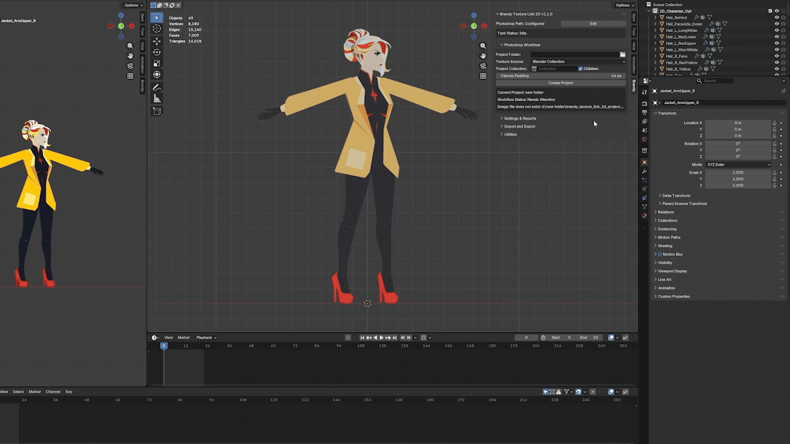
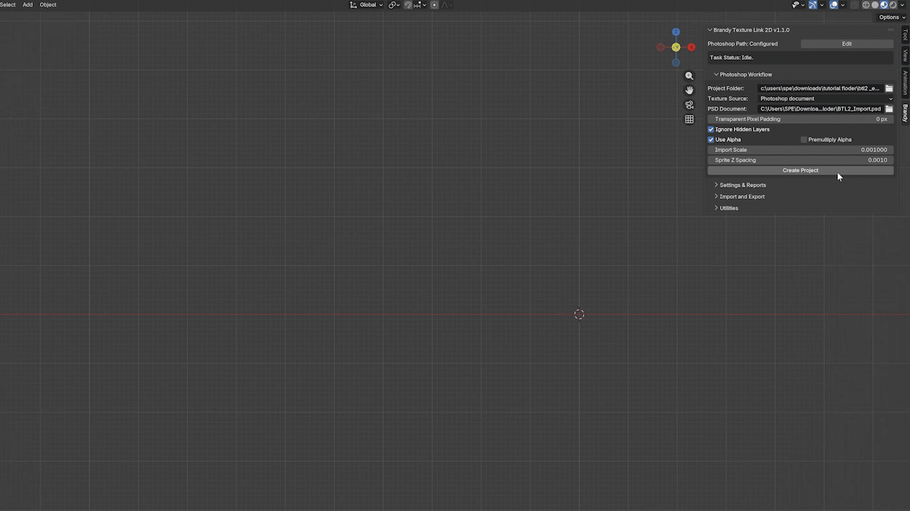
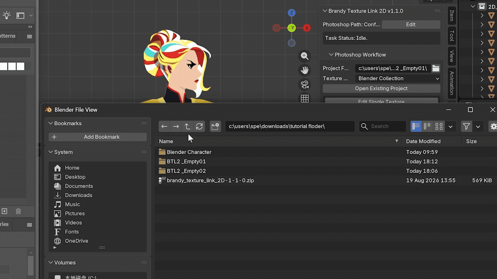

# Brandy Texture Link 2D —— 中文主页

[快速入门](docs/快速入门.md) · [用户指南](docs/用户指南.md) · [技术支持](docs/技术支持.md) · [维护信息](docs/维护信息.md) · [更新日志](docs/更新日志.md) · [README](README.md)

**本 Blender 插件专为 2D 游戏或动画管线设计，用于编辑平面模型的贴图，并围绕 2D 项目创建 Blender 与 Photoshop 的长期关联。**

## 核心功能

按照 Blender 中 2D 面片的贴图排列顺序，创建 Photoshop 文档与图层，并建立关联：

将整个 PSD 文档导入 Blender，并为每个图层创建一张 2D 面片模型，之后建立关联：

快速编辑与自动刷新：

批量编辑多张贴图：

按贴图遮挡关系分配新增像素：

对透明区域进行可控处理：

智能分配单图层中的新增像素：

在多个项目包之间进行自由切换：

## 实用链接

[快速入门](docs/快速入门.md) —— 快速上手，建议配合演示教程使用。

[YouTube 演示教程](https://www.youtube.com/watch?v=Hcl-jo4UIig) —— 6 分钟掌握插件核心功能。

[用户指南](docs/用户指南.md) —— 深度使用、设计边界与错误排查。

[技术支持](docs/技术支持.md) —— 联系方式与售后服务。

[维护信息](docs/维护信息.md) —— 测试信息。

[更新日志](docs/更新日志.md) —— 更新内容。

[README](README.md) —— 英文主页。

## 获取渠道

Superhive 商品页：https://superhivemarket.com/products/texture-link-2d

Itch 商品页：https://brandyspe.itch.io/texture-link-2d

免费获取轻量版贴图编辑插件，GitHub 开源项目 Brandy Texture Link Lite：https://github.com/BrandySPE/Brandy-Texture-Link-Lite

## 支持信息

### 支持环境

* Windows x64
* Blender 4.2.0 - 5.2.0（含 5.2.0）
* Adobe Photoshop 桌面版 CC2017 - 2026（含 2026）

### 支持项目类型

* 2D 游戏与动画管线，2D 角色与场景。
* 格式为 PNG、JPG、JPEG、TGA 的贴图。
* PSD 中的平面角色或分层内容。
* Blender 中的矩形面片模型。

## 附加说明

插件支持中英双语，您可通过**设置与报告**分栏中的**插件界面语言**修改默认语言，修改后需要重新加载插件或重新启动 Blender。

插件还附带少量导入导出功能与便捷工具，以及诸多为防护与恢复设计的隐藏按键，详情可查看`用户指南`文档。

项目包作为项目关联的桥梁，专门针对项目备份与恢复、安全撤销、多项目切换、项目副本迁移等防护性内容进行了设计，并完成了 7 * 5 个版本的矩阵测试（包含 Blender 5.2.0 LTS），详情可查看`维护信息`文档。

如果您有疑问或者需要反馈，可查看`技术支持`文档或联系：`brandyspe2026@gmail.com`，我看到邮件后会尽快回复。

Brandy Texture Link 2D 原名为 Brandy 2D Link，更名后的第一个公开版本为 `1.1.0`。

此次更名同时伴随核心功能的全面优化，加入了 PSD 文档导入、分配待合并图层、透明区域控制、Alpha 信息改写等全新功能，并对 UI 内容进行了精简化重构，使其更加符合实际使用中的需求和感受。

对于获取过旧版本的用户，已完成新版本的补发。

为了便于观看，GIF 图中的插件操作等待时间均进行了合理裁剪，实际等待时间受项目大小与设备性能影响。演示中所用角色为包含 49 个 2D 面片、骨骼、动画的真实 Blender 工程。

## 许可证与独立产品声明

插件包采用 GPL-3.0-or-later 许可证发布，并包含对应源代码。

Brandy Texture Link 2D 是独立产品，与 Adobe、Blender Foundation 及其相关组织不存在隶属或背书关系。商标信息见 [NOTICE.md](NOTICE.md)。

