# Brandy Texture Link 2D — Quick Start

[README](../README.md) · [User Guide](UserGuide.md) · [Support](Support.md) · [Maintenance](Maintenance.md) · [Change Log](ChangeLog.md) · [快速入门](快速入门.md)

This guide is for getting started with Brandy Texture Link 2D. It is best used together with the [YouTube demo](https://www.youtube.com/watch?v=-xTnPTlHHwc).

For advanced workflows, limitations, and troubleshooting, see the [User Guide](UserGuide.md).

## Create a Project

Install and enable the add-on in Blender.

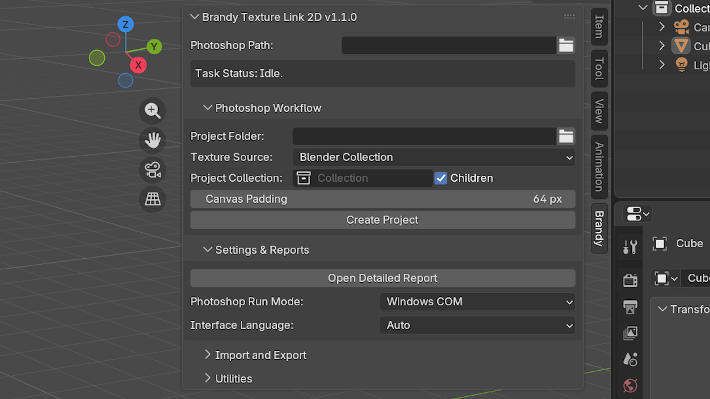

Under **Photoshop Path**, select `Photoshop.exe` from your Photoshop installation folder.

Under **Project Folder**, choose an empty local folder.

Set **Texture Source** to either **Blender Collection** or **Photoshop document**, depending on where you want to start:

If you choose **Blender Collection**, put all flat rectangular mesh objects you want to edit (referred to below as 2D sprites) into one Blender collection, then select that collection under **Project Collection**.

At minimum, a valid 2D sprite should be a flat rectangular mesh with a unique name, a valid active UV layer, and one clearly identifiable main texture.

If a texture is packed into the `.blend` file, unpack it before creating the project and, when possible, keep it on a local drive.

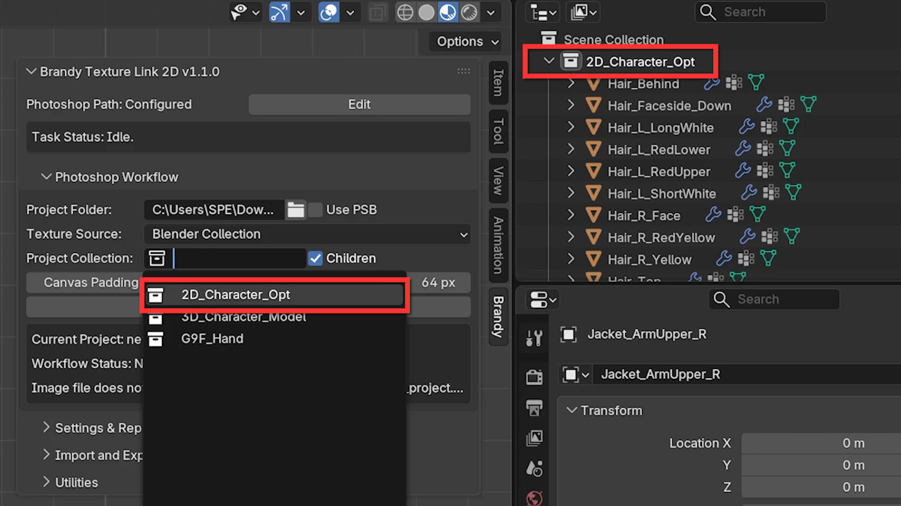

If you choose **Photoshop document**, select the PSD you want to import under **PSD Document**, then set the import options shown below.

For PSD files with complex structures, simplify the document when practical. If the file contains many linked Smart Objects, layer styles, or similar content, the add-on provides **Simplify Complex Layers**, **Skip Complex Layers**, and **Preserve Usable Content**. Complex effects may still look different after import.

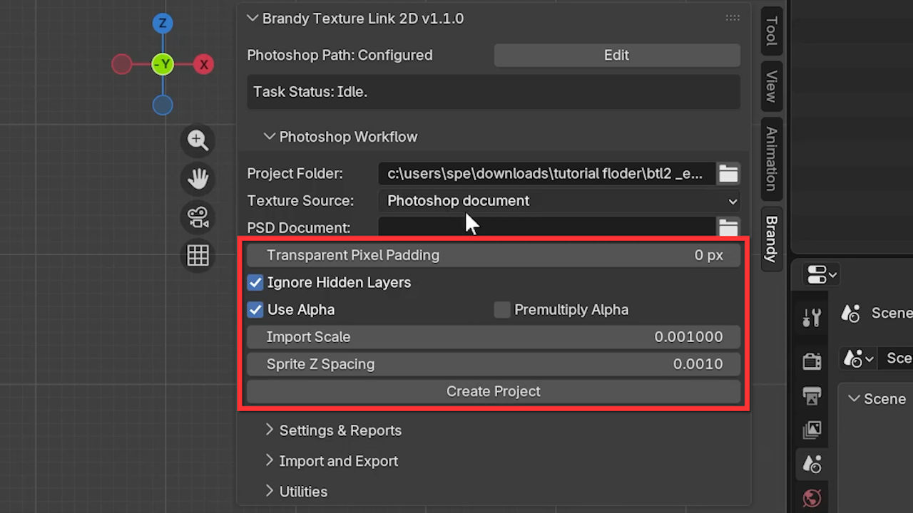

When the setup is ready, click **Create Project**. The add-on creates the project folder and launches Photoshop. Your original textures or source PSD are not modified.

The working PSD contains three layer groups: **BTL2 Linked Content**, **BTL2 Merge Layers**, and **BTL2 Merged Layers**. Later operations use these groups, so do not delete them.

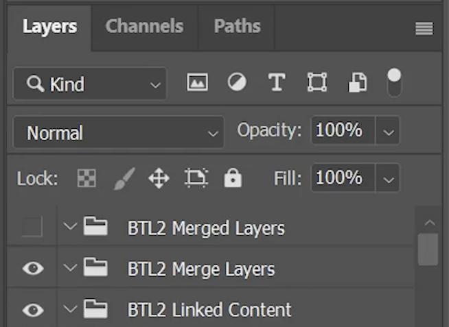

## Edit a Single Texture

After the project is created, the main editing controls appear below.

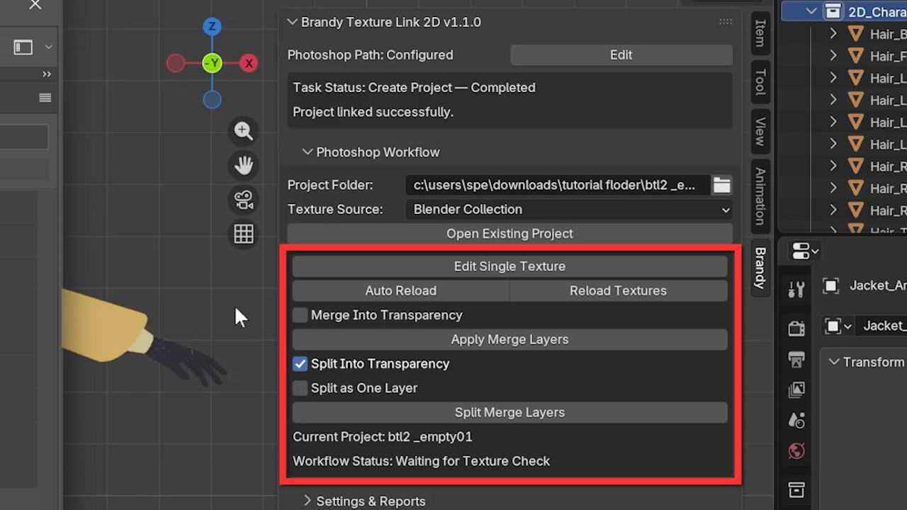

Select a 2D sprite in Blender and click **Edit Single Texture** to open its matching texture file for editing.

With **Auto Reload** enabled, saving the texture with `Ctrl+S` automatically reloads it in Blender after a short delay. If Auto Reload is disabled, use **Reload Textures** to update it manually.

When you edit and save a texture through **Edit Single Texture**, the add-on updates its stored Alpha data to match the texture's edited Alpha. This keeps the Alpha reference accurate after you erase existing pixels and affects how **Merge Into Transparency** and **Split Into Transparency** work later.

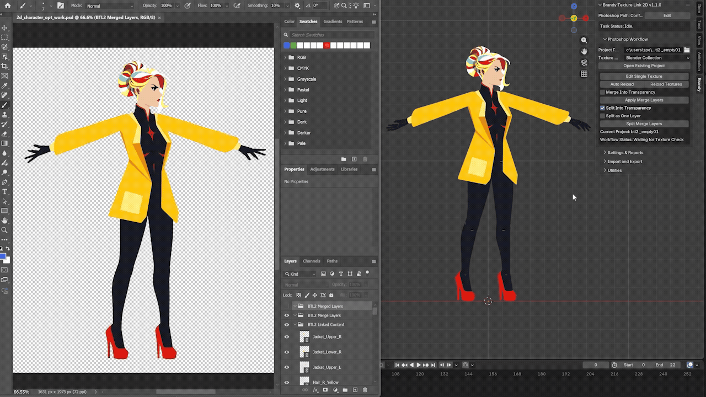

You can also double-click a Smart Object in the working PSD and edit the texture there. Saving can still trigger Auto Reload, but this method does not update that stored Alpha data.

You can change the texture content and Alpha, but do not change the pixel width or height of the project texture.

## Edit Multiple Textures

Multi-texture editing mainly uses **Apply Merge Layers** and **Split Merge Layers**:

- **Apply Merge Layers**: Writes new content to matching textures by layer name.
- **Split Merge Layers**: Uses the same name matching, then also handles overlaps according to texture stacking order so hidden lower textures do not receive the same new pixels twice.

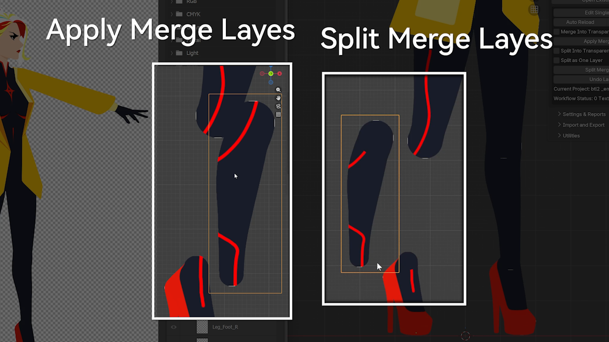

This section is easier to follow together with the [YouTube demo](https://www.youtube.com/watch?v=-xTnPTlHHwc).

### Apply Merge Layers

For example, suppose you want to edit three textures named Leg_Thigh, Leg_Shin, and Leg_Foot.

Create three new layers in the working PSD and name them Leg_Thigh, Leg_Shin, and Leg_Foot.

When the painting is ready, place all three layers inside **BTL2 Merge Layers** and save the working PSD.

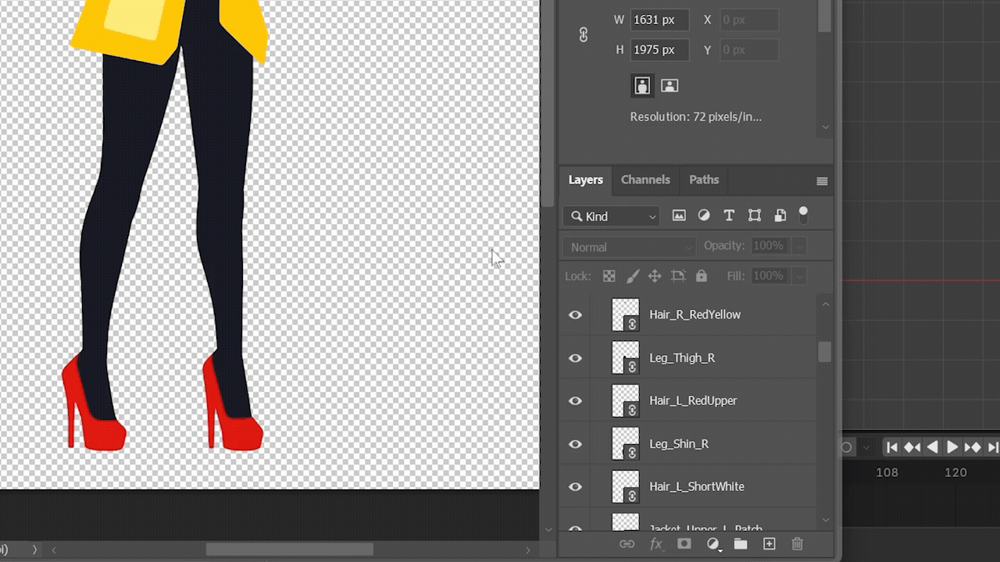

Click **Apply Merge Layers**. The add-on writes each layer into the matching texture by name, then reloads the changed textures in Blender.

The same workflow can be used with more than three layers.

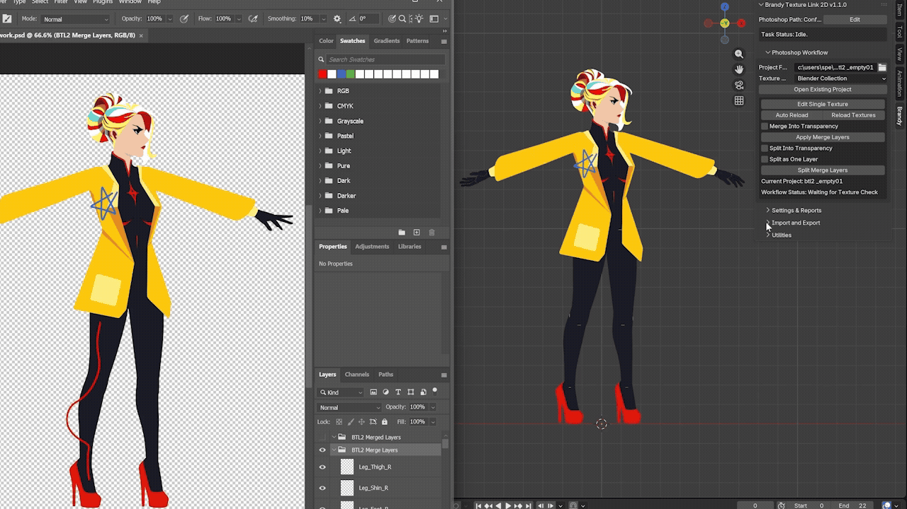

**Merge Into Transparency** controls whether new pixels can be written into transparent areas. When disabled, the existing Alpha is preserved. When enabled, new pixels can extend into transparent areas of the texture.

### Split Merge Layers

The setup is similar to **Apply Merge Layers**, but **Split Merge Layers** also handles overlaps according to the front-to-back order of the textures.

For example, to paint one continuous pattern across Leg_Thigh, Leg_Shin, and Leg_Foot, paint the full pattern first, then make three identical copies. Rename them to match the three textures, place them inside **BTL2 Merge Layers**, save the working PSD, and click **Split Merge Layers**.

In overlapping areas, the new pixels are assigned to the frontmost Leg_Thigh texture first. That overlap is then removed from the remaining result before the Leg_Shin texture behind it receives its pixels, so the continuous artwork is distributed according to the texture stacking order.

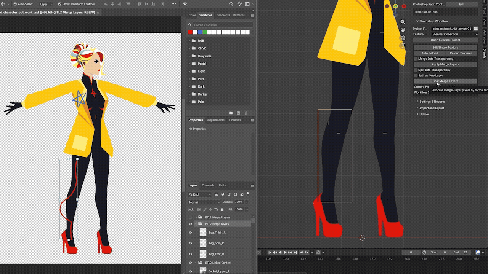

**Split Into Transparency** controls whether distributed pixels can be written into transparent areas. When disabled, the existing Alpha is preserved. When enabled, new pixels can extend into transparent areas of the texture.

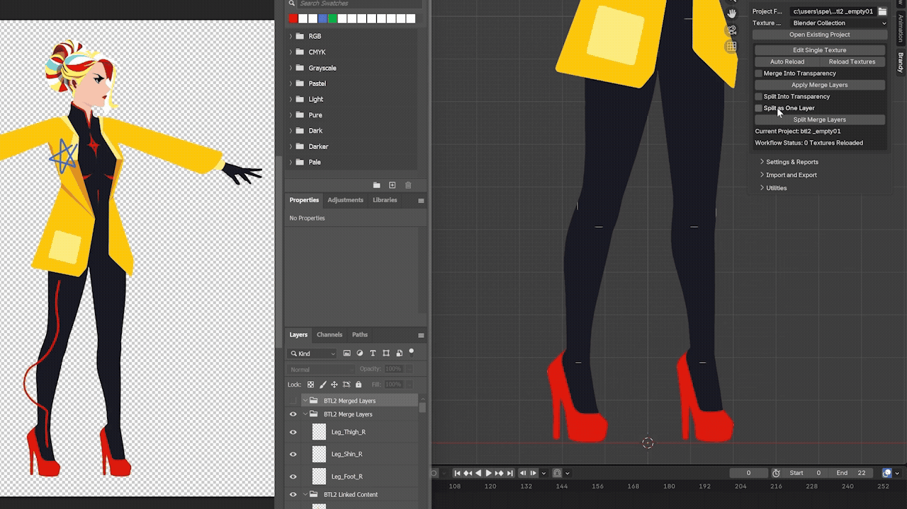

### Split as One Layer

This option only affects **Split Merge Layers** and automates the distribution step.

If you do not want to duplicate and rename the same painted layer for every texture, enable **Split as One Layer**. Place one new layer that crosses several textures inside **BTL2 Merge Layers**. The add-on detects the new pixels and distributes them to the covered textures using the same logic as **Split Merge Layers**.

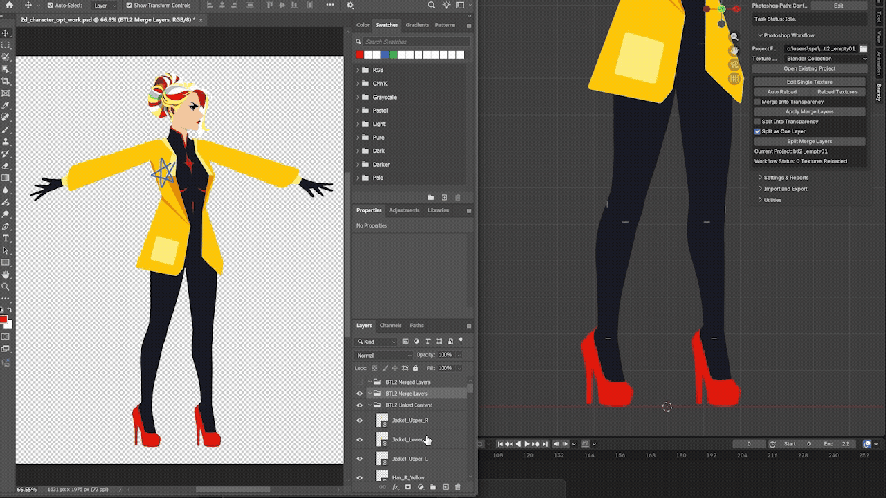

### Undo

After a valid **Apply Merge Layers** or **Split Merge Layers** operation, the matching **Undo Last Apply** or **Undo Last Split** action appears.

Undo restores the textures changed by that operation. Only the most recent valid Apply or Split can be undone; running the next valid Apply or Split replaces the previous undo state.

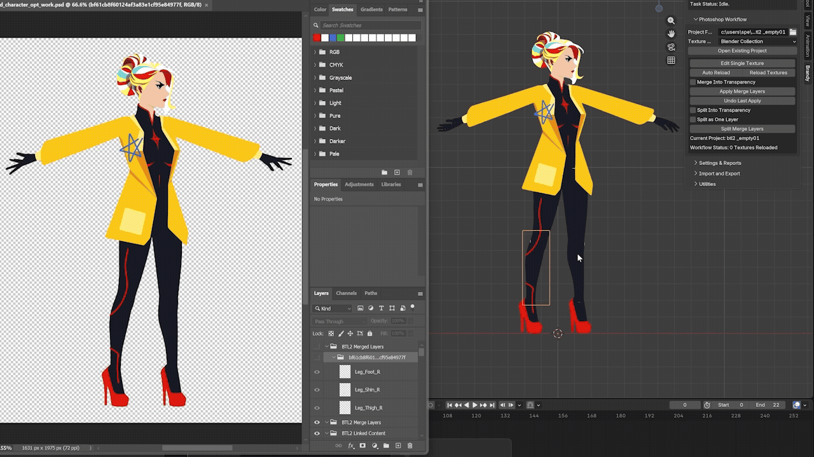

## Troubleshooting

If a task does not finish as expected, check the message shown in the add-on and use **Open Detailed Report**. The report includes the reason for the failure, execution details, and suggested steps for resolving it.

For more settings, special workflows, and troubleshooting, see the [User Guide](UserGuide.md).
